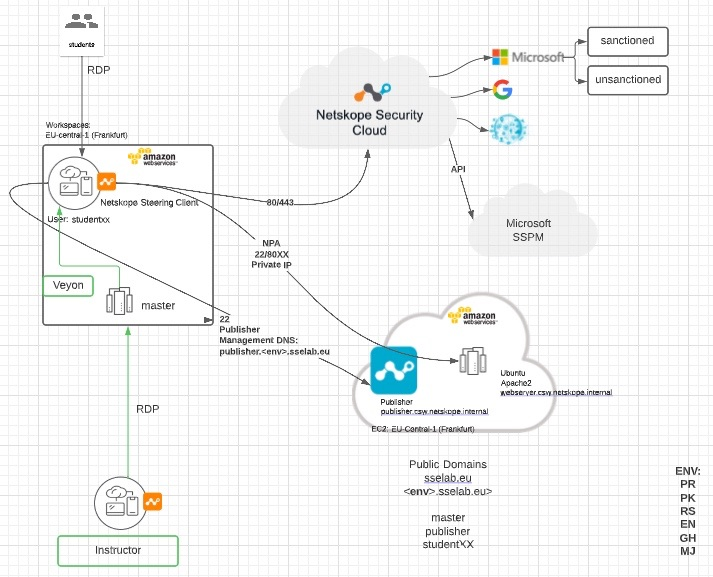

**<h1> Netskope Cloud Security Workshop automation through Terraform Workspaces </h1>**

This terraform module creates Netskope Hands On Lab Environment with predefined custom student images that contain neccessary configuration parameters for the lab

terraform works with so called workspaces, so you can switch into individual "working environments". One can create multiple lab environments in different workingspaces at the same time.

Every workspace creates a DNS subzone of sselab.eu in the initials of the individual instructor

terraform.state will be saved on remote S3 buckets with versioning, encryption enabled in DynamoDB

---


Install Docker & Docker compose

**Export the Cloud Security Workshops AWS environment variables (pinned to slack channel #netskope-csw)**

**clone git repo:**
         ```
         git clone https://github.com/PhilRumi/netskope-csw
         ```

**to start the environment:**
                           ```
                           docker-compose run cloudworkshop make apply
                           ```

**to destroy the environment:**
                                     ```
                                     docker-compose run cloudworkshop make destroy
                                     ```

---
**SLACK: #dach-how_aka-csw** with all pinned information and credentials

**Public DNS access:**
- Publisher SSH: publisher."ENV".sselab.eu
- Master Instructor RDP: master."ENV".sselab.eu
- Guacamole HTTPS: guacamole."ENV".sselab.eu
- Student RDP: studentXX."ENV".sselab.eu

**Environments can be extended by:** 
- 1st modifying the "workspaces.tf" file by copying the relevant data block using a new name
- 2nd creating the new workspace by unsing "docker-compose run cloudworkshop terraform workspace new <name>"

**Environment**: <br>

